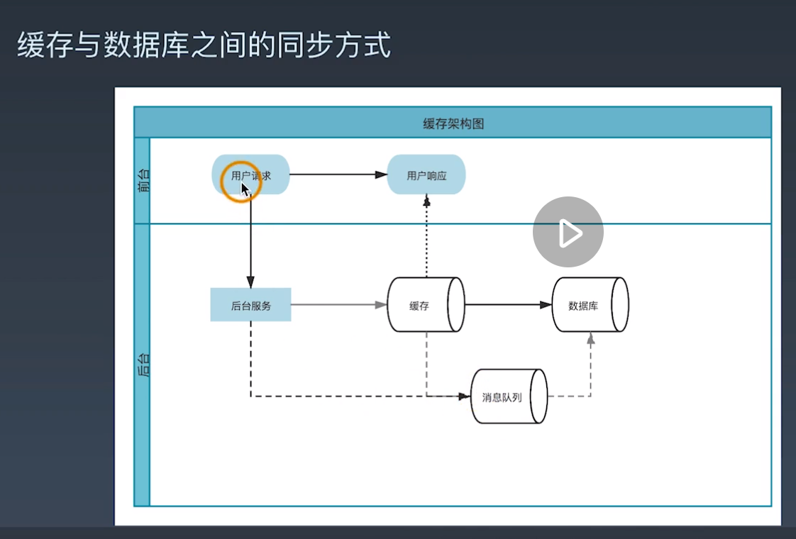

学习笔记

01為什麼使用中間件&緩存的類別
====
1. 緩存
   1. 併發數量大，數據庫無法扛住併發壓力。
   2. 複雜場景解偶，消息隊列
   3. 場景豐富造成訪問熱點
2. 緩存分類
   1. 本地緩存: 存在應用程序如Django，時間效率較高
   2. 分布是緩存: 遠程，若本地沒有，則到後端，通常是Redis。容量較高
   3. 思考: 
      1. 各自存儲數據的特點是甚麼?
      2. 各自適合的場景是甚麼?  ex: 分布式 遊戲排名、排行

02緩存的同步方式有哪些
====
1. cach aside讀取緩存，如果用戶請求有，就返回，若沒有則向數據庫請求到緩存。優點容易理解，缺點對業務代碼侵入。
2. write back, 用消息對列每隔一個時間同步到數據庫。但可能數據丟失的風險。對一致性要求不高的場景。 
3. 寫入方式
   1. 雙寫方式: 多線程，容易實現，但也容易緩存、數據庫不一致。改變方式，先寫數據庫、再寫緩存。
   2. 消息隊列: 當數據庫寫入成功後，再寫入緩存。要考慮程序cash時，消息隊列的訊息不會丟失。
   3. MySQL Binlog二進制日誌: 最穩定，但是是線性的，性能最差。
4. 都會有訊息不一致性和性能延遲的問題。



03緩存可能出現的問題
====
1. 緩存穿透
   1. 人為的分布式拒絕服務攻擊
   2. 若查詢結果是空值，可以直接到redis裡面存null結果
   3. 布隆過濾器，有誤殺的概率
2. 緩存併發
   1. 值存在，但某一個key過期，但剛好大量用戶請求
   2. 互斥鎖, redis的setnx，
3. 緩存雪崩:
   1. redis設置不合理，緩存大量的key，同一時間過期，大量的請求經過redis進入數據庫。
   2. 不讓大量的key同時失效。
   3. 多級緩存，大量併發不要同時打到數據庫。

04安裝Redis、連接Redis
====
1. Redis 6.0後開啟多線程的技術，作為緩存來用，類似mysql的數據庫。
2. 舊版多個會話會相互干擾
3. 對象類型
   1. 字符串: int超過八個字節，會轉換成embstr或raw，建議使用時將key固定在8個字節以內。字節過多會佔過多空間。
   2. 列表: 時間換空間的存儲。
   3. 哈希
   4. 集合: 
   5. 有序集合
4. 安裝redis-6.0.9版本
```Shell
#需先將gcc 版本從4.8.5升級到8.0
yum install centos-release-scl scl-utils-build
yum list all --enablerepo='centos-sclo-rh'
yum install -y devtoolset-8-toolchain
#安裝完後以以下指令啟動
scl enable devtookset-8-toolchain
gcc --version
#在centOS的系統，先從根目錄進入redis-6.0.9目錄
cd redis-6.0.9
make ; make install 
#安裝完成後，redis會有以下文件
which redis-server
#返回/usr/local/bin/redis-server
which resis-cli
#返回/usr/local/bin/redis-cli   
#redis-6.0.9目錄下會有redis.conf配置文件，可以修改工作方式。可以複製到etc下面，來更改redis.cnf配置文件
vim /etc/redis.cnf     
:set nu  #在vim編輯器中顯示行號
#找到requerspass，將密碼修改得足夠複雜
#找到bind，將ip改為0.0.0.0 監聽所有ip位置。
:wq #寫入後退出vim編輯器

#啟動redis
redis-server /etc/redis.conf
ss -ntpl | grep 6379  #過濾端口，查看redis是否正確啟動起來。
#關閉redis
redis-cli  ##進入redis
127.0.0.1:6379> auth yourpassword
127.0.0.1:6379> shutdown
```
5. 在python如何連接redis
```shell
pip install redis
```
開啟mod5_redis_conn.py
```python
import redis
client = redis.Redis(hots='server1', password='pass')
print(client.keys()) #連接測試，生產環境不要用此指令。返回列表，bytes。
for key in client.keys(): 
   print(key.decode())
```

05Redis字符串使用場景
====
1. 打開mod5_redis_string.py
```python
#主要用set跟get來做溝通

client.set('key', 'value')
result = client.get('key')

print(result.decode())
```
2. 即使遇到相同的key，set會覆蓋掉原有的值，可用nx=True參數，讓key的value不被後續set()更改
```python
client.set('key', 'value2', nx=True) #若遇到key已經存在，不會覆寫該key的value
result = client.get('key') 
print(result.decode())
#輸出結果仍是value，而非value2
```
3. 修改字符串，為key後面增加字符
```python
client.append('key', 'value4')
result = client.get('key') 
print(result.decode())
# >> valuevalue4
```
4. 值的加減
```python
client.set('key2', '100')
result2 = client.incr('key2') #+1
result3 = client.decr('key2') #-1
print(result2)  #101
print(result3)  #100 
```
5. 字符串大部分是紀錄映射關係，將數據存到內存到中，查詢會非常快。用戶都入之後，從數據庫寫入redis，後續用戶直接從redis查詢，會非常快速。
6. 字符串只用在小量的資料，百萬級以下可以；若超過百萬，則要用哈希，消耗的內存只有字符串結構1/4的大小，查詢效率卻是相同的。
7. 查詢單個key，可以使用get()，但查詢所有的key，可以用keys*，就像sql的select *，但這時會造成redis短暫無法響應的情況，因為要把所有key列出來。若數據量達到百萬，無法響應的時間可能會達到秒級。若不清楚有多少key之前，不要輕易用key*這樣的指令。

06Redis列表
====
1. 打開mod5_redis_list.py  
```python
# index也支援負索引-1，跟python一樣
client.lpush('list_redis_demo', 'python') #從左側填入列表
client.rpush('list_redis_demo', 'java') #從右側
#不要盲目把所有資料拉出來，先看長度
print(client.llen('list_redis_demo')) #list的length
# 彈出數據 lpor()  rpop()
data = client.lpop('list_redis_demo') #輸出 b'python'
print(data)

#查看一定範圍的list數據
data = client.lrange('list_redis_demo', 0, -1) 
print(data)
```

2. 實際場景中，當作隊列用，批量做事情。短信網關有併發限制，先存入redis中，分批發送。其中沒有成功的用戶，再重新發一次。發送成功則rpop()彈出，若沒有成功則lpush()放回隊尾，確保所有用戶都發送成功。
3. 循環發送
```python
while True:
   phone = client.rpop('list_redis_demo')
   if not phone:
      print('發送完畢')
      break
   # sendsms(phone)
   # result_time = retry_once(phone)
   # if result_times >= 5:
   #    client.lpush('list_redis_demo', phone)
```
4. redis用於批量發短信、通知、禮物等，可處理大量資料。

07Redis集合(set)
====
1. 往集合添加值
```python 
print(client.sadd('redis_set_demo', 'new_data'))  #成功添加進去返回1，若以包含相同內容，則會添加失敗，返回0
client.spop() #隨機彈出，真的隨機數
client.smember('redis_set_demo') #顯示

#最有用的兩個集合的運算
#交集
client.sinter('set_a', 'set_b')     #a已經買尿布的人, b已經買啤酒的人

#並集
client.sunion() 

#差集
client.sdiff() 
```
2. 去重，丟入集合自動完成；兩個集合的交集、並集、差集。

08Redis哈希
====
1. 查詢單個key的時候，查找時間都不會增加。應用紀錄用戶是否為VIP，對應值設為1，反之刪除或設為0。
2. 增加和刪除
```python
client.hset('vip_user', '1001', 1) #新增
client.hset('vip_user', '1002', 1)     
client.hdel('vip_user', '1002') #刪除

print(client.hexists('vip_user', '1002')) #查找是否存在
```
3. 存字符串或哈希? 哈希優化更好，佔用內存小很多。例如: instagram使用python開發，從字符串轉為哈希，節省內存從十幾G降到5G。
4. 批量添加大量值
```python
client.hmset('vip_user', {'1003':1. '1004':1})
#讀取值，hkeys  hget  hmget  hgetall，其中hmget逐漸被取代，主要掌握其他三個。
field = client.hkeys('vip_user') 
print(field)  #返回結果  [b'1001', b'1003', b'1004']
print(client.hget('vip_user', '1001'))  #取得一個字段  b'1'
print(client.hgetall('vip_user'))  #取得所有用戶與值  {b'1001':b'1', b'1003': b'1'}
```
5. 遇到取得出來，取不出來的。不能用return的方式判斷，而是print的結果來判斷。
6. 取出來是bytes，需要用for迴圈迭代的方式，decode()轉換
7. Redis哈希比起字典，除了key, value，還多出name，用name對應業務各種關係，儲存大量數據且效率極高。

09Redis有序集合
====
1. zset存儲數據量愈長，查詢等操作愈長。不重複的值、且自動排序。例如: 玩完一輪遊戲要做資料更新，若用其他程序做一次排序，會造成過多的負擔。
```python
client.zadd('rank', {'a':4, 'b':3, 'c':1, 'd':2, 'e':5}) #資料添加
client.zincrby('rank', -2, 'e') #將e排名改為3
result = client.zrangebysocre('rank', 1, 5) #按照評分由小到大排序
print(result) # [b'c', b'd', b'd', b'e', b'a']
#zreank 從大到小

client.zcard('rank') #基card, 返回5，一共有五個值

#顯示評分
client.zrange('rank', 0, 1, withscorese=True) #[(b'c', 1.0), (b'd', 2)] 從小到大
client.zrerange('rank',0,2,withscores=True) #從大到小
```

10Redis的重要機制
====
1. 生存時間
   1. 雖然現在內存足夠大，但還是要考慮硬件成本。通常儲存「熱數據」，極少發生修改的數據。
   2. 設定過期策略，保證數據的弱一致性，定期與惰性過期混合。
   3. LRU、LFU，例如: mysql用戶很多，要預留20%熱數據空間，可使用redis的LRU淘汰策略。
2. 主從複製
   1. 保證redis的可用性。與集群不一樣，。
   2. 從服務器只能讀取，主服務器可寫、可讀。默認round robin，但從服務器的規格不同，所能承擔的能力也不同，要分別設置。
   3. 從服務器不支持多主服務器。
3. 哨兵
   1. redis工作在不同模式下，監控主、從服務器是否正常運行，並透過API通知或提醒客戶端。
   2. 若主服務器無法正常運作，哨兵依設置的策略將從服務器升級為主服務器，通知客戶端已選好的新主服務器，通知下次從主服務器連接。
   3. 主從複製，夫妻兩人探險遇難，丈夫去求救，丈夫回來就妻子，但獵人跟妻子說丈夫已經遇難，妻子面臨兩難要跟誰走。這時如何判斷主服務器是連線斷掉或是掛掉，那其他從服務器就面臨兩難。這時哨兵的角色便是將獵人或丈夫槍斃掉，使程序可以正常運行。哨兵也會有運行不正常的時候，所以採多個節點。
   4. 高可用集群的仲裁概念: 設置一個奇數，較偶數容易選。最少三個節點，規避單獨網線連接主服務器，保證哨兵高可用的特性。哨兵仲裁的值加上存活服務器的值，一定要能把另外的一個服務器給他投票，投下去。例如: 每個節點的權重是一，哨兵至少也要是從節點的數量之和。128 < n+ 1 =129。
   5. 當哨兵發現主觀下線或客觀下線，對當前生命週期自增。
      1. 看遷移時間是否超過故障時間的兩倍，選擇其他節點(從服務器)。
      2. 發該從服務器的時間狀態短時間可以回復，則發起slaveof no one，將其生為主服務器。
      3. 通過訂閱的功能，將更新的配置傳給其他的哨兵。
      4. 通過Fence將淘汰的服務器保護起來，開槍把他幹掉，slaveof，將原本的主服務器改為從服務器。否則會發生腦裂與新的主服務器沒辦法傳遞訊息。
      5. 修改其他從服務器指向新的主服務器。
   6. 自動遷移的邏輯較為穩妥。
4. 過期時間、主從複製，了解redis的特性，可以設置主動或被動的過期時間，以便盡可能利用內存。雖不用維護redis，但其機制可保證數據的可用性。連接的節點可能非真正的redis節點或哨兵節點，客戶端需要做相應的準備，或常連接。

11消息隊列的用途
====
1. 上游與下游系統的聯繫。購買多件商品時使用購物車，即是緩存的功能。採集數據，存到數據庫的過程中，輸入和輸出是一個不對等的關係，也可以引入隊列做一個緩存。
2. 異步處理
   1. 以購物流程為例，一個請求分發到不同系統。
3. 流量控制
   1. 假如開門前讓大家排隊，只銷售100台，那後100可以選則等待或離開
   2. 令牌發生器，不是發給用戶，在後台有令牌隊列，有一個進來就消費一個。101個進來沒取到，不能進來，可等待或下次再去購買。
4. 服務解藕
   1. 上游與下游之間的接口改變，就要重新上線。透過消息隊列，系統間訂閱相同的主題，用隊列實時傳送訊息，你的接口也不用改。
5. 隊列最基本功能，傳遞消息與緩存，以上三個是衍伸的功能更貼近現實的需求。例如B-樹應用到mysql。
6. 消息隊列的模型: 
   1. 隊列模型: 先進先出FIFO，目的為聯通，裡面儲存的就當作緩存。
   2. 發布訂閱模型: 處理異步處理、服務解藕。
      1. 例如一個主題底下，有多少個接收者，通過隊列，可以輪流讓兩個接收者或同時接收。
7. 保證嚴格的有序性。

12RabbitMQ的主要結構
====
1. 最老牌的消息隊列
2. RabbitMQ是AMQP的代理服務器
3. 安裝，rabbitMQ是以Erlang開發，可能帶來軟件開發的問題，許多互聯網公司轉用RocketMQ(基於java)
```shell
yum install rabbitmq-server     
rabbitmq-plugins enable rabbitmq_management #啟動後需要重新啟動rabbitMQ
systemctl start rabbitmq-server   #正確的工作端口是5672
ss -ntpl | grep 5672  #其他插件在25672, 15672端口。瀏覽器server1:15672 可以查看。改對應的密碼，否則容易被人入侵。
```
4. 點擊guest。
   1. 改密碼
   2. 新增用戶、刪除
   3. queues頁籤，真正的緩衝區。支持一個或多個生產者與消費者。
   4. channel 底層是TCP連接，為何不建立多個TCP而是虛擬線程? 因TCP啟動關閉，反覆連接較消耗資源
   5. exchanges(rabbitMQ獨有)，direct一對一的概念，一個生產者，一個消費者。當一個生產者對多個消費者時，雖可用queues，但一個消息只能被一個消費者所消費。這時用fanout，把應用發來的訊息給exchange(交換機)，後面再連接多個queues，此過程稱為綁定，給每一個對列發相同的消息。
      1. topic， 多對一，多個交換機到一個隊列，使用routing_key將指定類型傳到指定的隊列當中。

13RabbitMQ的隊列方式用法
====
1. 常見四種連接方式、架構
   1. P >queue>C, 一旦主機當機還是存在佔存內
   2. P > queue > C1, C2 
   3. P > X(exchange) > queues 交給兩個不同隊列，兩個消費者可各自對queue做處理
   4. P > X(exchange) > queues 根據關鍵字傳到不同
2. 實際掩飾, 開啟mod5_rabbit_publish.py與mod5_rabbit_subscribe.py
```python
#pip install pika   
credentials = pika.PlainCredentials('guest', 'pass')  #依據不同業務，設置不同的用戶密碼，千萬不要不同業務用共同帳戶

connection = pika.BlockingConnections(parameters) #pika異步基礎上，消息接受發布的異步。阻塞狀態的連接，客戶端連接阻塞時，

channel.queue_declare(queue='direct_demo', durable=False) #信道基礎上建立隊列連接，存在的話直接用，不存在則建立一個
#publish跟subscribe都可以宣告連接, 建議兩邊都宣告，避免消費者先運行，結果根本沒有這個隊列
#durable隊列持久化

#exchange留空，則會用默認的交換機
channel.basic_publish(exchange='', routing_key='direct_demo', body='send message to rabbiting' ) 
#body會以json形式發送
```
3. 到瀏覽器查看發送端的結果
4. 打開mod5_rabbit_subscribe.py
```python
channel.basic_consume('direct_demo', on_message_callback=callback)
#開始接收信息，並進入阻塞狀態，暫停處理。等到有足夠資源，再進行分配
channel.start_consuming()

def callback #接到訊息後，要進行怎樣的處理。
ch.basic_ack() #為防止消息丟失，手動確認消費者是否繁忙或接收
```

14RabbitMQ訂閱發布模型的用法
====
1. 打開mod5_rabbit_taskqueue_pub.py
```python
#與前一個插異，修改隊列名稱、開啟持久化

```
2. 打開mod5_rabbit_taskqueue_sub.py
```python
#消息數未達到，則不向該消費者發送消息
channel.basuc_qos(prefetch_count=1)

#callback time.sleep(1)休眠，來看過程
#模擬多個使用者，輪循的方式接收用戶發起的消息
#仍是傳統的對列方式

```
3. 併行方式，訂閱模式, 打開mod5_rabbit_fanout_pub.py
```python
channel.exchange_declare(exchange='log', exchange_type='fanout') #不會直接把消息發給隊列
#routing_key='' 默認的方式
#logs是名稱，可以自己定義
#pub與sub都聲明，誰先啟動，誰先申明
#消費者啟動將隊列binding到exchange，P啟動查看exchange與哪些隊列綁定。消費者消失後，連隊列一起刪掉
#auto_ack=True自動確認接收消息


```
4. 若pub先啟動，再啟動兩個sub，sub是不會接受到任何訊息，生產者也不知道消費者有沒有接受到消息。綁定的隊列綁定錯或進程中止，sub也是收不到訊息。
5. 回到網頁看connections阻塞，channels兩個且有queue。queues隊列有兩個且隨機名稱。exchange是log、fanout，綁定兩個隊列。
6. 最後一種架構，routing_key設置成匹配的對象queue，*.org、baidu.#等關鍵字。

15消息隊列經常遇到的三個問題
====
1. 如何保證事務在分布式消息隊列的一致性?
   1. 開啟一個事務"半消息"，消息對消費者來說不可見，發送成功後，訂單系統就可在本地執行事務，執行成功再把購物車清除。若過程不成功，再把半消息回退，即分布式事務管理。
   2. 2PC二階段提交、TCC，使用分布式管理。實時性要求不高，盡量等幾秒鐘，再做後續的操作。
2. 如何保證消息不丟失?
   1. 確認消息到客戶端，再把隊列裡的消息清除。序號檢測，不連續，代表丟失消息。例: 丟了一個消息，不再用該用戶處裡訊息
3. 如何處理重複消息?
   1. 至多被送達一次，保證不重複
   2. atleastonce，保證至少一次
   3. 恰好一次，最高的服務等級，幾乎難以達到。
4. 冪等性，判斷表是否存在，再去創建。重複沖值、扣款。寫入訊息前，先做加減，例如: 將金額從100扣10為90，系統先判斷資料是否為90，若已經是90則不再做加減。
   1. 利用數據庫的唯一約束