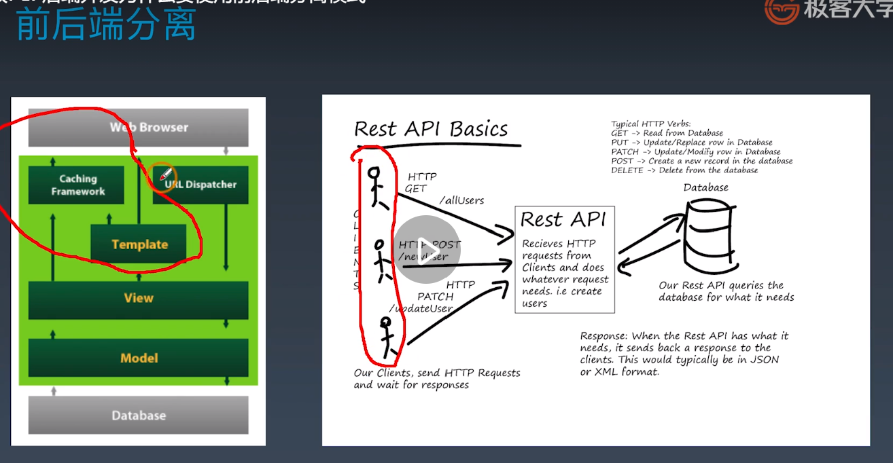

学习笔记
01後端開發為什麼要使用前後端分離模式
====
1. 前後端分離的優缺點
   1. 前後端職責不清
   2. APP類應用開發模式無法和MVC兼容(或MTV)
   3. 對前端性能造成侷限


02REST API的用途和書寫規範
====
1. Template與view如何確保通信協議?
2. http協議「GET請求、POST提交」
3. REST概念
   1. 表現層狀態轉化，reoresentational state transfer
      1. 服務端將內部資源發布REST服務
      2. 客戶端通過URL來定位這些資源並通過HTTP協議來訪問他們
   2. 動詞:
      1. GET: 讀取
      2. POST: 新建
      3. PUT: 更新
      4. PATCH: 部分更新
      5. DELETE: 刪除
   3. 規範
      1. 系統上一切對象都要抽象為資源，用名詞來命名
      2. 每個資源對應唯一的資源標示
      3. 對資源的操作不能改變資源標示(URI)本身
      4. 所有的操作都是無狀態的
4. 操作要返回原數據，以便理解操作是正確的。
```python
{
    "meta": {
        "success": true,
        "message": "ok"
    },
    "data": ...
}

```
5. 風格指引
   1. 盡量將API部屬在專用域名之下
   2. 應該將API的版本號放入URL
   3. 路徑又稱"終點"(endpoint)，表示API的具體網址
   4. API應該提供參數，過濾返回結果
   5. 服務器應該向用戶返回正確的狀態碼和提示信息
   6. 最好做到Hypermedia，即返回結果中提供鏈接，連向其他API方法，使得用戶不查文檔，也知道下一步應該做甚麼
6. 透過github的api文檔學習
   * https://api.github.com
   * https://docs.github.com/en/rest/overview/resources-in-the-rest-api
  
03使用Django快速實現REST API
1. 安裝djangorestframework
2. 序列化from rest_framework import serializers
3. views: FBV vs. CBV
4. 下載tutorial
5. 在settings.py中，將"rest_framework"加到INSTALLED_APPS當中。
6. 當專案變大時，不建議直接加載到主配置文件settings.py中，而是以透過"snippets.apps.SnippetsConfig"引入。
```python
#app文件夾snippets底下的app.py
from django.apps import AppConfig

class SnippetsConfig(AppConfig):
    name = 'snippets'
```
7. 設置好installed_apps更改後，要執行makemigrations，同步數據庫。
```shell
python manage.py makemigrations
python manage.py migrate

#創建超級用戶
python manage.py createsuperuser --email a@a.com --username user1

#運行
python manage.py runserver
```
8. 在網頁可以看到新增加的用戶名與數量。
9. 在quickstart中有serializers跟views，沒有templates。打開views.py。
10. 查看UserViewSet，
    1.  有queryset，知道要返回那些數據
    2.  有serializer_class，知道要用甚麼方式訪問
        1.  打開serializers.py中的class UserSerializer，抽象程度愈高，內容編寫會愈簡單。抽象愈低，則可自訂化。
        2.  HyperlinkedModelSerializer，可以超連結直接點。
        3.  Meta指定model跟fields要展示那些字段。
        4.  如果不想要增刪，只要讀取，則要修改serializers.py與views.py的功能。
```python
#viewsets.ModelViewSet  高級的抽象
#1. 查找queryset，其中user是系統建立好的model，在model.py中並沒有創建他，透過command加左鍵追蹤User。
#2. User是繼承AbstractUser，定義那些字段，從基本用戶與Mixin配合使用。
#3. serializer展示User，若要展示則需要permission權限。全縣市自己定義的，在permission.py。
```

04實現用戶登錄註冊驗證功能
====
1. 從最核心的功能開始實現，打開mircoblog_v1
2. 先從models.py構建，只需Articals
   1. 編寫文章與用戶的序列化
   2. 編輯視圖，用戶和文章，以及函數視圖將以上兩個做連接
   3. 編寫permission.py
   4. 編寫urls.py路徑，被最外層的urls.py引入。因為使用mysql，所以引入__init__.py，正常看的時候，視反過來讀的，從__init__.py開始讀。
3. 編寫順序
   1. settings.py，編寫installed_apps，引入apps。
      1. 修改數據庫設定
      2. REST_FRAMEWORK設置，支持Basic、Token、Session三種驗證方式
         1. Basic帶帳號、密碼登入，但只要有人攔截數據包，容易被盜；使用POST方式登入
         2. Token，生成後，存在客戶端，工作中多數使用這種。前端跟REST API盡量在內網當中。
         3. Session，通過網頁登錄。功能完善後，用來驗證的方式。
      3. PAGE_SIZE, 默認指返回10條，若沒有設定，則會增價大量讀取。
   2. Urls.py，在urlpatterns中添加功能的urls。