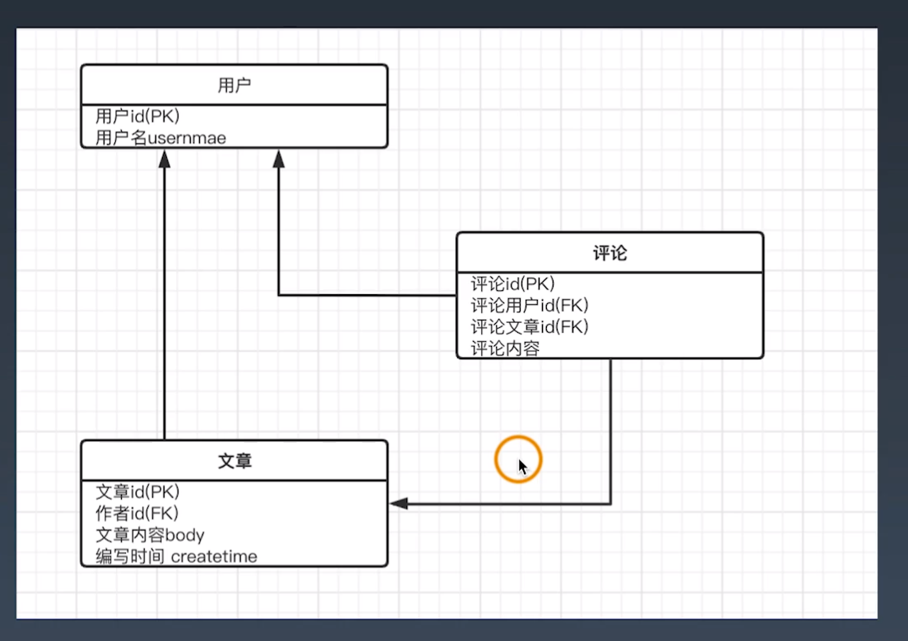

学习笔记
01後端開發為什麼要使用前後端分離模式
====
1. 前後端分離的優缺點
   1. 前後端職責不清
   2. APP類應用開發模式無法和MVC兼容(或MTV)
   3. 對前端性能造成侷限


02REST API的用途和書寫規範
====
1. Template與view如何確保通信協議?
2. http協議「GET請求、POST提交」
3. REST概念
   1. 表現層狀態轉化，reoresentational state transfer
      1. 服務端將內部資源發布REST服務
      2. 客戶端通過URL來定位這些資源並通過HTTP協議來訪問他們
   2. 動詞:
      1. GET: 讀取
      2. POST: 新建
      3. PUT: 更新
      4. PATCH: 部分更新
      5. DELETE: 刪除
   3. 規範
      1. 系統上一切對象都要抽象為資源，用名詞來命名
      2. 每個資源對應唯一的資源標示
      3. 對資源的操作不能改變資源標示(URI)本身
      4. 所有的操作都是無狀態的
4. 操作要返回原數據，以便理解操作是正確的。
```python
{
    "meta": {
        "success": true,
        "message": "ok"
    },
    "data": ...
}

```
5. 風格指引
   1. 盡量將API部屬在專用域名之下
   2. 應該將API的版本號放入URL
   3. 路徑又稱"終點"(endpoint)，表示API的具體網址
   4. API應該提供參數，過濾返回結果
   5. 服務器應該向用戶返回正確的狀態碼和提示信息
   6. 最好做到Hypermedia，即返回結果中提供鏈接，連向其他API方法，使得用戶不查文檔，也知道下一步應該做甚麼
6. 透過github的api文檔學習
   * https://api.github.com
   * https://docs.github.com/en/rest/overview/resources-in-the-rest-api
  
03使用Django快速實現REST API
1. 安裝djangorestframework
2. 序列化from rest_framework import serializers
3. views: FBV vs. CBV
4. 下載tutorial
5. 在settings.py中，將"rest_framework"加到INSTALLED_APPS當中。
6. 當專案變大時，不建議直接加載到主配置文件settings.py中，而是以透過"snippets.apps.SnippetsConfig"引入。
```python
#app文件夾snippets底下的app.py
from django.apps import AppConfig

class SnippetsConfig(AppConfig):
    name = 'snippets'
```
7. 設置好installed_apps更改後，要執行makemigrations，同步數據庫。
```shell
python manage.py makemigrations
python manage.py migrate

#創建超級用戶
python manage.py createsuperuser --email a@a.com --username user1

#運行
python manage.py runserver
```
8. 在網頁可以看到新增加的用戶名與數量。
9. 在quickstart中有serializers跟views，沒有templates。打開views.py。
10. 查看UserViewSet，
    1.  有queryset，知道要返回那些數據
    2.  有serializer_class，知道要用甚麼方式訪問
        1.  打開serializers.py中的class UserSerializer，抽象程度愈高，內容編寫會愈簡單。抽象愈低，則可自訂化。
        2.  HyperlinkedModelSerializer，可以超連結直接點。
        3.  Meta指定model跟fields要展示那些字段。
        4.  如果不想要增刪，只要讀取，則要修改serializers.py與views.py的功能。
```python
#viewsets.ModelViewSet  高級的抽象
#1. 查找queryset，其中user是系統建立好的model，在model.py中並沒有創建他，透過command加左鍵追蹤User。
#2. User是繼承AbstractUser，定義那些字段，從基本用戶與Mixin配合使用。
#3. serializer展示User，若要展示則需要permission權限。全縣市自己定義的，在permission.py。
```

04實現用戶登錄註冊驗證功能
====
1. 從最核心的功能開始實現，打開mircoblog_v1
2. 先從models.py構建，只需Articals
   1. 編寫文章與用戶的序列化
   2. 編輯視圖，用戶和文章，以及函數視圖將以上兩個做連接
   3. 編寫permission.py
   4. 編寫urls.py路徑，被最外層的urls.py引入。因為使用mysql，所以引入__init__.py，正常看的時候，視反過來讀的，從__init__.py開始讀。
3. 編寫順序
   1. settings.py，編寫installed_apps，引入apps。
      1. 修改數據庫設定
      2. REST_FRAMEWORK設置，支持Basic、Token、Session三種驗證方式
         1. Basic帶帳號、密碼登入，但只要有人攔截數據包，容易被盜；使用POST方式登入
         2. Token，生成後，存在客戶端，工作中多數使用這種。前端跟REST API盡量在內網當中。
         3. Session，通過網頁登錄。功能完善後，用來驗證的方式。
      3. PAGE_SIZE, 默認指返回10條，若沒有設定，則會增價大量讀取。
   2. Urls.py，在urlpatterns中添加功能的urls。

05實現文章關聯功能
====
1. 打開micorblog的urls.py，路徑當中體現版本v1，當新版本v2不能用時，保持v1，可以繼續使用。把用戶屬性帶進去，進到first/urls.py。
2. first/urls.py其中DefaultRouter是由SimpleRouter的擴展，預設都有articles跟users的API。Default則多了API root，請求到根目錄時，就會有入口介面。root_view_name重寫，自訂'api_root'。
3. 在views.py，即可看到DefaultRouter的api_root函數。@api_view()是透過from rest_framework.decorators import api_view導入，功能為接受視圖應響應的http方法。GET也可以改成POST，則只接受POST，或是改為['GET',"POST"]兩者都接受。
   1. Response的返回是rest_framework的返回，與預設的區別為，可以返回dict的字符串。通過註冊的名字'user-list'和'article-list'來取出反向的urls。
   2. request參數得到請求，format是標準的格式，這邊不設定，所以是None。
4. 基於class的views，viewsets有不同的寫法，若用ReadOnlyModeViewSet，返回的內容只能讀取。
5. 用戶序列化serializers.py，
   1. articles是通過序列化和主鍵關係的關聯，和文章的id是不同的
6. 在views.py中，ArticleAPIViewSet，權限是以permission.IsOwnerOrReadOnly，繼承BasePermission，重寫has_object_permission，讀時不需要做登入；用戶名稱和請求的user一致，則可以寫入。
   1. perform_creat函數，是從viewsets.ModelViewSet繼承，而ModelViewSet又是從GenericViewSet繼承；用mixin的方式，引入Create、Retrieve等CRUD五個方式。
   2. CreateModelMixin中，當model創建時create，創建完成之後perform_create執行serializer.save()。在ArticlaeAPIViewSet中，另外設定perform_create額外保存owner為self.request.user，把用戶也做關聯、保存。
7. serializer_class找到model對應序列化的類。
8. 用DRF功能，url的關聯關係會自動生成，不用畫ER圖，透過連接方便交叉訪問。

06給Django REST framework擴展文檔和用戶創建功能
====
1. 自動將API生成文檔，include_docs_urls，title=BBS，左側為
2. serializers.py裡設定Meta時，exclude與fields是互斥的選項，不能兩個都加。
   1. 創建要有password，查看不要有password。
   2. def validate調用make_password將密碼散列，存到attrs['password']
   3. 校驗則是check_password()。
3. 引用到createuserView的時候，基本上繼承自ModelViewSet
   1. 創建用戶def create的功能，調用save()前要調用is_valid()。
   2. def list可以自行設置。
   3. def retrieve用戶詳情，user包含密碼，通過del data['password']將password刪掉。
   4. create將密碼加密
4. 打開網頁create user list，測試創建user。創建後返回的資料，則是在serializer中meta中定義的。
5. 如何在文章編輯增加標題字段，在models.py的class Articles增加title的欄位，再做makemigrations跟migrate。再到serializers.py的class ArticleSerializer底下的meta新增fields=['title']。
6. 通過命令行測試
```shell
#1. 安裝套件與查詢
pip install httpie 
http GET http://127.0.0.1:8000/api/v2/articles/3/

#2. 修改
http PUT http://127.0.0.1:8000/api/v2/articles/3/ article='Hello' #會報錯，因為沒有經過驗證
http -a admin:admin PUT http://127.0.0.1:8000/api/v2/articles/3/ article='Hello' #兩個admin分別為用戶名跟密碼

#3. 刪除
http -a admin:admin DELETE http://127.0.0.1:8000/api/v2/articles/3/
```

07如何擴展現有用戶屬性
====
1. 打開v3版本，原本用預設的user model，現在要做更多功能，例如: 積分，則可以使用userprofile。
2. 打開urls.py，已增加router.register(r'userprofile', views.UserProfileViewSet, 'user-profile') 
   1. 使用第三方登入(wechat或QQ)，再返回用戶訊息
   2. 打開網頁連結仍是v2，因為api共用，所以沒有更動
   3. 下面已增加userprofile的欄位，打開django官方user model的擴展說明，目前使用的為第一種方法
3. 代碼擴展實現，views.py, serializers.py, models.py，以下是官方文檔說明，可以以此方法擴展與同步。
```python
#1. 定義個userprofile class，在裡面新增model欄位
username = models.OneToOneField(User, related_name="profile") #當前用戶名和User是一對一的關係，此User為Django預設的

#2. 給定義增加屬性
def get_blacklist(cls):
   return cls.objects.filter(is_active=False)

#3. 使用receiver裝飾器，當模型創建原始用戶的時候，不會連動、添加用戶，要讓user跟userprofile連動起來。
UserProfile.objects.create(username=instance) 
#當創建User的時候，將username綁訂到userProfile上

#4. receiver第一個參數是signal，跨模型通信可以用signal激活程序
@reciever(post_save, sender=User)  #當User產生post_save信號時，激活底下被裝飾的函數

#5. 不是創建的時候也要激活，保證關聯的model可以進行同步。
instance.profile.save() 
```
4. 打開serializers.py，打開views.py，
5. 官方文檔自定義用戶模型，一定要繼承AbstractBaseUser，原始的用戶(包含admin)就會失效。
6. 當程序愈大，要改為自定義的用戶，驗證時用JWT的方式，更方便關聯第三方的登入。

08增加評論功能，實現兩個自定義Model的關聯屏
====
1. 打開V3，將回覆、評論與文章聯繫，添加model也要有關聯。
2. 繪製ER圖


3. 只有登入者可以評論，評論的文章兩個外鍵。另外再加回覆id。
```python
#打開models.py
__tablename__ = "posts"
```
4. serializers.py設定要顯示的訊息，PostsSerializer。

09實現搜索和站內消息
====
1. 用戶與用戶間評論後，有個通知功能。以及搜索功能。
2. 搜索請求方式，urls後面articles/?search=blog，如何實現?
   1. 在install_apps安裝django_filters
   2. 打開views.py中，使用DRF的搜索，直接from django_filters import rest_framework as rf_filters，較簡單實現搜索功能。
```python
filter_backends = (rf_filters.DjangoFilterBackend, filters.SearchFilter,)
```
   4. 在filter.py中，設置搜索的class。fields設只搜索那些自斷。在views.py中，透過from .filter import ArticlesFilters。
   5. 再設定搜索時要用哪個字段，search_fields = ['title', 'body']，因為上面返回的也只有這兩個字段。
   6. 建議先閱讀官方文檔的quickstart，了解DRF。
1. 如何發送站內信?可以打開官方文檔 https://docs.djangoproject.com/en/2.2/topics/signals/
   1. 可以使用notify.send()，notify是定義好的功能。verb放入通知的訊息。
   2. 發送的訊息是持久化，要在installed_apps引入notifications，也需要做migrate，遷移到數據庫。
   3. 發送者、接收者、動詞。
   4. 打開views.py，如何找到發送者的id以及接收者的id。
   5. 如果想要在網頁上直接展示評論內容，在Response的時候，將訊息加進去。看到class UserViewSet
   6. 只在retrieve的時候顯示，從user底下找到unread()通知，mode_to_dict以免覆蓋，組成key與列表。實際上應該在serializers.py裡面設計，而不是在response之前展示。
2. notifications.unread()還有沒有其他的功能? notify裡的訊號，可以到官網看。https://pypi.org/project/django-notifications-hq/