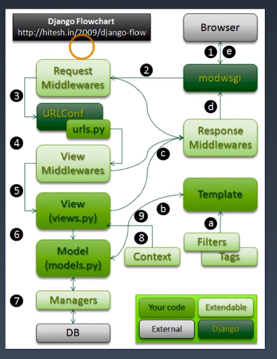

学习笔记
01Django源碼分析之URLconf的偏函數
====
1. 『偏函數』降低調用的難度。打開urls.py，主要是urlpatterns，path與re_path如何實現? crtl+左鍵點擊path，找到他在django源代碼底下的conf.py。
2. path = partial()，再繼續看partial，到python標準酷的functools.py。也可以直接看到它是從from functools import partial。
3. 知道是標準庫，就可以到python官方文檔的標準庫參考functools。https://docs.python.org/zh-tw/3.7/library/functools.html
4. partial為偏函數，固定一些參數，在特定情境傳遞某些參數。_path可以在re_path跟path函數間重複調用。
5. 固定參數的功能怎麼實現? 看官方文檔的範例
```python
def partial(func, *args, **keywords):
    def newfunc(*fargs, **fkeywords):
        newkeywords = keywords.copy()
        newkeywords.update(fkeywords)
        return func(*args, *fargs, **newkeywords)
    newfunc.func = func
    newfunc.args = args
    newfunc.keywords = keywords
    return newfunc
```
6. 記功能，以一個簡單的例子來記憶，使用int('10010',base=2)將2進制轉成十進制。偏函數可以將base=2固定下來，不用再重複寫。文檔demo
```python
from functools import partial
basetwo = partial(int, base=2)
basetwo.__doc__ = 'Convert base 2 string to an int.' #通過__doc__寫下文檔說明
basetwo('10010')
18
```
7. 要注意:
* partial第一個參數必須是可調用對象
* 參數傳遞順序是從左到右，但不能超過源函數參數個數
* 關鍵字參數會覆蓋partial中定義好的參數

02Django源碼分析之URLconf的include
====
1. include將子項目的類型作拆分。關鍵在執行import_module(urlconf_module)，其中urlconf_module的值即是include('index.urls')中帶入的參數，會將參數的內容當作module導入。
```python
if isinstance(urlconf_module, str):
        urlconf_module = import_module(urlconf_module)
```
2. 接著將導入的urlconf_module，經過getattr將patterns裡的內容取出來，存到pattern。
```python
    if isinstance(urlconf_module, str):
        urlconf_module = import_module(urlconf_module)
    patterns = getattr(urlconf_module, 'urlpatterns', urlconf_module)
    app_name = getattr(urlconf_module, 'app_name', app_name)
    return (urlconf_module, app_name, namespace)
```

03Django源碼分析之view視圖的請求過程
====
1. render、查詢管理器 雖然寫在views.py，但屬於templates。views主要處理請求與返回。
2. request對象，最典型的，render視功能更強大的HttpResponse的功能。
3. manage.py進行加載文件，WSGI的功能，發起請求HttpRequest由WSGI創建。HttpResponse是開發者創建。
4. HttpRequest看__init__方法，初始化那些東西，需要關注meta源數據，裡面會儲存瀏覽器發起request的頭部訊息header，
```python
class HttpRequest:
    """A basic HTTP request."""

    # The encoding used in GET/POST dicts. None means use default setting.
    _encoding = None
    _upload_handlers = []

    def __init__(self):
        # WARNING: The `WSGIRequest` subclass doesn't call `super`.
        # Any variable assignment made here should also happen in
        # `WSGIRequest.__init__()`.

        self.GET = QueryDict(mutable=True) 
        self.POST = QueryDict(mutable=True)
        self.COOKIES = {}
        self.META = {}
        self.FILES = MultiValueDict()

        # 將頭部訊息分拆
        self.path = ''
        self.path_info = ''
        self.method = None
        self.resolver_match = None
        self.content_type = None
        self.content_params = None
```
5. 跟蹤QueryDict(MultiValueDict)，找到MultiValueDict，是django裡面自帶的工具。裡面的樣例是
```python
    >>> d = MultiValueDict({'name': ['Adrian', 'Simon'], 'position': ['Developer']})
    >>> d['name']
    'Simon'
    >>> d.getlist('name')
    ['Adrian', 'Simon']
    >>> d.getlist('doesnotexist')
    []
    >>> d.getlist('doesnotexist', ['Adrian', 'Simon'])
    ['Adrian', 'Simon']
    >>> d.get('lastname', 'nonexistent')
    'nonexistent'
    >>> d.setlist('lastname', ['Holovaty', 'Willison'])
```
6. 運行python manage.py runserver，在瀏覽器中，用get方式傳送參數，?id=1&id=2&name=wilson，而QueryDict(MultiValueDict)可以將兩個id變成一個dict帶有兩個參數。
7. 到django的官方文檔，把HttpRequest看懂，這樣就能掌握views.py。

04Django源碼分析之view視圖的響應過程
====
1. 打開官方文檔
2. 打開views.py，查看test1等範例
3. 查看HttpReponse的源代碼, __init__帶入的第一個參數content就是'Any text'，真正要返回的內容。*args與**kwargs是從瀏覽器中抓取header訊息進去，若要修改Response Header的內容，只要在HttpResponse()內給該key指定value，在瀏覽器檢視畫面中，就可以看到header內容被修改。
4. 返回json格式，引用from django.http import JsonResponse。該函數也是繼承自HttpResponse，關鍵在data = json.dumps(data, cls=encoder, **json_dumps_params)，製作成json的格式。其中要增加頭部訊息，可以實例化一個JsonPresonse，後續再用dict的操作方式，指定key與value增加裡面的值。
```python
def test2(request):
    # 使用HttpResponse的子类
    from django.http import JsonResponse #實際工作當中，要寫到文檔開頭，符合PEP8代碼規範。
    response3 = JsonResponse({'foo': 'bar'})  # response.content
    response3['Age'] = 120

    from django.http import HttpResponseNotFound
    response4 = HttpResponseNotFound('<h1>Page not found</h1>')
    return response4
```
5. 增加頭部訊息，自訂義後header，可作為過濾、反爬蟲的功能。
6. 查看HttpResponseNotFound，返回的status_code為404。該status_code繼承自>HttpResponse>HttpResponseBase。

05Django源碼分析之view試圖的請求響應完整流程
====


1. 透過modwsgi傳送至request middleware中間件，如果有問題，直接返回到response middlewares。
2. request middlewares有過濾功能，傳到urls.py，再到view middelware中間件過濾。
3. 若通過，由views.py返回內容；若有調用數據庫的內容，則到models.py，經過manager查詢管理器到database。若有template在view中將template匯進來。最後再回到modwsgi。
4. template並不是直接返回，而是透過model>view>response middleware。view做兩件事，拋出異常或正確的內容。
5. response middleware統一處理再回modwsgi。Web server gateway interface。Django生產環境與開發環境如何部屬。manage.py運行時運用WSGI handler
6. Django上傳文件數據，是透過_files的屬性，而不是用POST方式。Response middleware返回是views中自己寫的。
7. 中間件會做全局處理

06Django源碼分析之model模型的自增主鍵創建
====
1. models.Model如何自動創建id，Model創建時，增加metaclass=ModelBase的屬性，而源類必須要包含__new__()的屬性，且繼承自type。
2. 查看到_meta是Options類的實例對象，所以調用的是django.db.models.options.py下的_prepare()發法。
3. 在_prepare()底下225行有if self.pk is None，判斷有沒有設置primary key，若沒有則增加auto_field，add_to_class('id', auto)。
4. base.py底下315行，new_class._prepare()增加主鍵，再用._meta.apps.register_model()註冊到database中。

07Django源碼分析之model模型的查詢管理器
====
1. T1.objects.all()查詢管理器怎麼改名字? 返回的值是QuerySet的對象，也是用_prepare()傳遞過來的。從objects查詢，找到BaseManager，看到該函數寫在Manager.py底下。
2. 查看BaseManager的父類為BaseManager，底下有from_queryset，
```python
    def from_queryset(cls, queryset_class, class_name=None):
        if class_name is None:
            #class_name = BaseManagerFromQuerySet
            class_name = '%sFrom%s' % (cls.__name__, queryset_class.__name__)
            #創建新的類
        return type(class_name, (cls,), {
            '_queryset_class': queryset_class,
            **cls._get_queryset_methods(queryset_class),
        })
```
3. 查看_get_queryset_methods，返回queryset的對象實例。
```python
        def create_method(name, method):
            def manager_method(self, *args, **kwargs):
                #返回的是QuerySet的對象實例
                return getattr(self.get_queryset(), name)(*args, **kwargs)
            manager_method.__name__ = method.__name__
            manager_method.__doc__ = method.__doc__
            return manager_method
```
4. objects> Manager> BaseManager> QuerySet , 用type去查會看到QuerySet類。
5. _get_queryset_methods底下，遍歷QuerySet方法
```python
new_methods = {}
        for name, method in inspect.getmembers(queryset_class, predicate=inspect.isfunction):
            # Only copy missing methods.
            if hasattr(cls, name):
                continue
            # Only copy public methods or methods with the attribute `queryset_only=False`.
            queryset_only = getattr(method, 'queryset_only', None)

            # 如果有開頭我_隱藏方法，則不賦予給queryset。
            if queryset_only or (queryset_only is None and name.startswith('_')):
                continue
            # Copy the method onto the manager.
            new_methods[name] = create_method(name, method)
        return new_methods
```
6. objects是BaseManager的實例，藉以下方是將objects改為object。object可以改成任意名稱。
```python
from django.db.models import Manager

class NewManager(Manager):
    pass

class T1(models.Model):
    id = models.BigAutoField(primary_key=True)
    n_star = models.IntegerField()
    short = models.CharField(max_length=400)
    sentiment = models.FloatField()
    object = NewManager()

    class Meta:
        managed = False
        db_table = 't1'
```

08Django源碼分析之template模板的加載文件
====
1. render不只是渲染而已，查看shortcuts.py
```python
def books_short(request):
    return render(requerst, 'result.html', locals())

# site-packages/django/shortcuts.py
def render(request, template_name, context=None, content_type=None, status=None, using=None):
    """
    Return a HttpResponse whose content is filled with the result of calling
    django.template.loader.render_to_string() with the passed arguments.
    """
    content = loader.render_to_string(template_name, context, request, using=using)
    return HttpResponse(content, content_type, status)
```
2. 查看render_to_string
```python
def render_to_string(template_name, context=None, request=None, using=None):
    """
    Load a template and render it with a context. Return a string.

    template_name may be a string or a list of strings.
    """
    if isinstance(template_name, (list, tuple)):
        template = select_template(template_name, using=using)
    else:
        template = get_template(template_name, using=using)
    return template.render(context, request)
```
3. 看到get_template，engines從_engine_list()獲取engine，則是從settings.py裡面的TEMPLATES裡面BACKEND指定的。不同引擎處理方式不同。
```python
def get_template(template_name, using=None):
    """
    Load and return a template for the given name.

    Raise TemplateDoesNotExist if no such template exists.
    """
    chain = []
    engines = _engine_list(using)
    for engine in engines:
        try:
            return engine.get_template(template_name)
        except TemplateDoesNotExist as e:
            chain.append(e)

    raise TemplateDoesNotExist(template_name, chain=chain)
```
4. EngineHandler()
```python
@cached_property  #將類封裝成屬性，且可以緩存
    def templates(self):
        if self._templates is None:
            self._templates = settings.TEMPLATES #加載settings.py
        templates = OrderedDict()
        backend_names = []
        #遍歷templates內容
        for tpl in self._templates:
            try:
                # This will raise an exception if 'BACKEND' doesn't exist or
                # isn't a string containing at least one dot.
                default_name = tpl['BACKEND'].rsplit('.', 2)[-2]
            except Exception:
                invalid_backend = tpl.get('BACKEND', '<not defined>')
                raise ImproperlyConfigured(
                    "Invalid BACKEND for a template engine: {}. Check "
                    "your TEMPLATES setting.".format(invalid_backend))

            tpl = {
                'NAME': default_name,
                'DIRS': [],
                'APP_DIRS': False,
                'OPTIONS': {},
                **tpl,
            }

            templates[tpl['NAME']] = tpl
            backend_names.append(tpl['NAME'])
        #將對配置文件進行格式化的處裡
```
5. 模板對應的文件如何找到目錄的，在engine.py裡面查看get_template與find_template，再到utils.py查看get_app_template_dirs。\site-packages\django\template\utils.py，其實也是被包含再EngineHandler這個類裡面。在每個app底下找叫做templates的目錄，把目錄加上對應的文件以返回。
```python
@functools.lru_cache()
def get_app_template_dirs(dirname):
    """
    Return an iterable of paths of directories to load app templates from.

    dirname is the name of the subdirectory containing templates inside
    installed applications.
    """
    template_dirs = [
        str(Path(app_config.path) / dirname)
        for app_config in apps.get_app_configs()
        if app_config.path and (Path(app_config.path) / dirname).is_dir()
    ]
    # Immutable return value because it will be cached and shared by callers.
    return tuple(template_dirs)

```
6. 怎麼找到settings.py配置，怎麼做目錄的拼接。

09Django源碼分析之template模板的渲染
====
1. 找到django.py
```python
# site-packages/django/template/backends/django.py
class Template:
    def __init__(self, template, backend):
    def render(self, context=None, request=None):
        return self.template.render(context)

# 调用了site-packages/django/template/base.py
class Template:
    def __init__()：
    # source存储的是模版文件中的内容
        self.source = str(template_string) # May be lazy
    def render(self, context):
        return self._render(context)
    def _render(self, context):
        return self.nodelist.render(context)
```
2. 查看base.py，def Template底下的self.source儲存模板文件中的內容。self.compile_nodelist()是初始化的核心，將內容分成tokens，每個元素都較token類型，把對應的內容解析，再做實例化，就變成node。根據不同內容、類型，做分割，並列起來為list。不用太深究，是語法解釋係的關鍵東西。
3. 跟蹤complie_nodelist，return parser.parse()。
4. 分好類後，根據不同的類調用render。
5. 如果是Node 类型，则会调用render_annotated 方法获取渲染结果，否则直接将元素本身作为结果，继续跟踪bit = node.render_annotated(context)。
```python
# Node类的两个子类
class TextNode(Node):
    def render(self, context):
        # 返回对象(字符串)本身
        return self.s
class VariableNode(Node):
    def render(self, context):
    try:
        # 不能直接返回，走則變量無法替換，使用resolve()解析后返回，
        output = self.filter_expression.resolve(context)
```
6. 語法解析器，根據正則對模式匹配
```python
class FilterExpression:
    def resolve(self, context, ignore_failures=False):

# 如何解析引用了类class Lexer:
class Lexer:
    def tokenize(self):
        # split分割匹配的子串并返回列表
        # tag_re是正则表达式模式对象
        for bit in tag_re.split(self.template_string):
        ... ...
        return result
# 定义四种token类型
def create_token(self, token_string, position, lineno, in_tag):
```
7. create_token分成四種，打開base.py底下，找到class lexer。
```python
# 定义四种token类型
def create_token(self, token_string, position, lineno, in_tag):
    if in_tag and not self.verbatim:
        # 1 变量类型，开头为{{
        if token_string.startswith(VARIABLE_TAG_START):
            return Token(TokenType.VAR, token_string[2:-2].strip(), position, lineno)
        # 2 块类型，开头为{%
        elif token_string.startswith(BLOCK_TAG_START):
            if block_content[:9] in ('verbatim', 'verbatim '):
                self.verbatim = 'end%s' % block_content
                return Token(TokenType.BLOCK, block_content, position, lineno)
        # 3 注释类型，开头为{#
        elif token_string.startswith(COMMENT_TAG_START):
            content = ''
            if token_string.find(TRANSLATOR_COMMENT_MARK):
                content = token_string[2:-2].strip()
                return Token(TokenType.COMMENT, content, position, lineno)
    else:
        # 0 文本类型， 字符串字面值
        return Token(TokenType.TEXT, token_string, position, lineno)
```
8. 對文本進行拆分，處理模板，一次或二次分類，使用大量緩存，可提升效率，是可以應用在其他程序開發。
