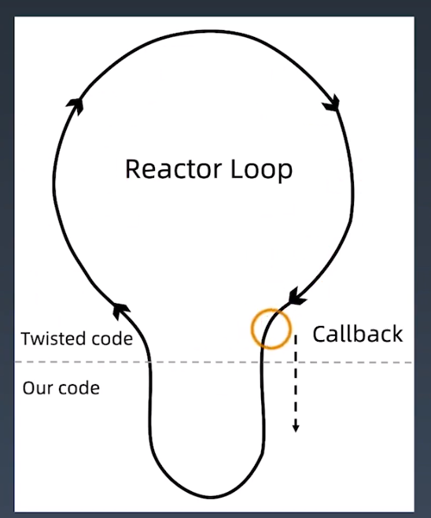

学习笔记
1. 获取课程源码操作方法：
切换分支：git checkout 3c
2. Twisted 学习参考文档：
https://pypi.org/project/Twisted/
3. asyncio — 异步 I/O 学习文档
https://docs.python.org/zh-cn/3.7/library/asyncio.html

01Scrapy併發參數優化原理
====
1. 為何單獨使用request效率沒那麼高? 同步與異步的概念。
2. 考慮目標網站乘載的性能，default為16，可提高或減少。
```python
settings 参数调优
# Configure maximum concurrent requests performed by Scrapy (default: 16)
# CONCURRENT_REQUESTS = 32
# Configure a delay for requests for the same website (default: 0)
DOWNLOAD_DELAY = 3 #時間的延遲，以免被反爬蟲而封掉
# The download delay setting will honor only one of:
# CONCURRENT_REQUESTS_PER_DOMAIN = 16
# CONCURRENT_REQUESTS_PER_IP = 16
```
3. 底層是以twisted外部框架所建構，基于twisted 的异步IO 框架
```python
多任务模型分为同步模型和异步模型
Scrapy 使用的是Twisted 模型
Twisted 是异步编程模型，任务之间互相独立，
用于大量I/O 密集操作。
```


4. 打開twisted_demo.py，