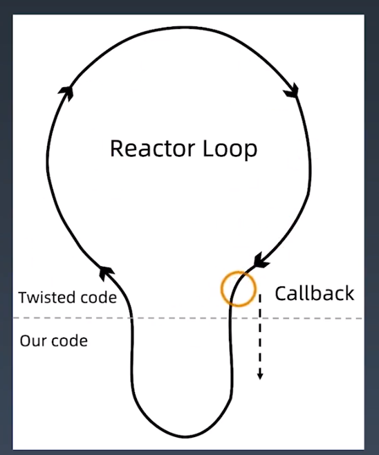
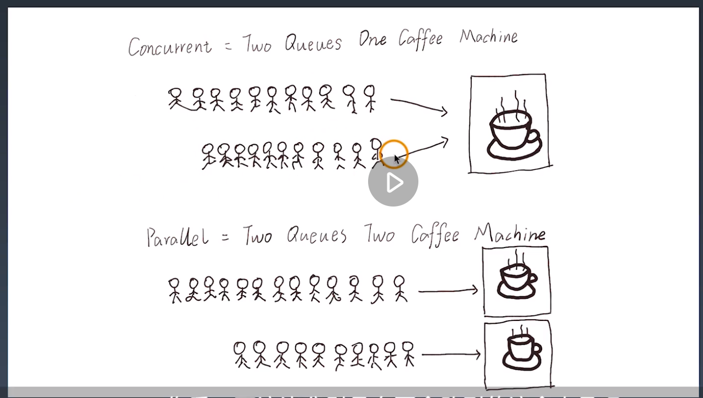

学习笔记
1. 获取课程源码操作方法：
切换分支：git checkout 3c
2. Twisted 学习参考文档：
https://pypi.org/project/Twisted/
3. asyncio — 异步 I/O 学习文档
https://docs.python.org/zh-cn/3.7/library/asyncio.html

01Scrapy併發參數優化原理
====
1. 為何單獨使用request效率沒那麼高? 同步與異步的概念。
2. 考慮目標網站乘載的性能，default為16，可提高或減少。
```python
settings 参数调优
# Configure maximum concurrent requests performed by Scrapy (default: 16)
# CONCURRENT_REQUESTS = 32
# Configure a delay for requests for the same website (default: 0)
DOWNLOAD_DELAY = 3 #時間的延遲，以免被反爬蟲而封掉
# The download delay setting will honor only one of:
# CONCURRENT_REQUESTS_PER_DOMAIN = 16
# CONCURRENT_REQUESTS_PER_IP = 16
```
3. 底層是以twisted外部框架所建構，基于twisted 的异步IO 框架
```python
多任务模型分为同步模型和异步模型
Scrapy 使用的是Twisted 模型
Twisted 是异步编程模型，任务之间互相独立，
用于大量I/O 密集操作。
```


4. 打開twisted_demo.py，

02多進程: 進程創建
====
1. 多任務與單任務，單任務較符合我們常識。單任務-同步>多任務-同步>多任務-異步。
2. 進程間的父子關係，使用os.fork()較底層，或是multiprocessiong.Process()兩種多進程套件。
3. 從os.fork()開始，打開p1_firstproc.py。windows不支持fork()，因為底層是以C++編寫，需要linux與Mac系統才能運行。
```python
import os

os.fork()
print('1111111111')

```
4. fork()能否再進一步區分，父進程>子進程>子進程，打開p2_fork.py。研究linux與mac底層進程創建的原理。
   * 利用返回值是否大於0，來判斷是否為父進程。
```python
# 区分父子进程
import os
import time

res = os.fork()
print(f'res == {res}')

if res == 0:
    print(f'我是子进程,我的pid是:{os.getpid()}我的父进程id是:{os.getppid()}')
else:
    print(f'我是父进程,我的pid是: {os.getpid()}')


# fork()运行时，会有2个返回值，返回值为大于0时，此进程为父进程，且返回的数字为子进程的PID；当返回值为0时，此进程为子进程。
# 注意：父进程结束时，子进程并不会随父进程立刻结束。同样，父进程不会等待子进程执行完。
# 注意：os.fork()无法在windows上运行。
```
5. 實際要開發，且在win運行，則用multiprocessing。打開p3_process.py。
   * 將每個任務定義成一個函數，target傳進來的是可調用對象、即是函數名稱。創建一個子進程。
   * 別名name，可以為每個進程取別名，方便控制。
   * args，kwargs，透過進程將參數帶到函數。
```python
# 参数
# multiprocessing.Process(group=None, target=None, name=None, args=(), kwargs={})

# - group：分组，实际上很少使用
# - target：表示调用对象，你可以传入方法的名字
# - name：别名，相当于给这个进程取一个名字
# - args：表示被调用对象的位置参数元组，比如target是函数a，他有两个参数m，n，那么args就传入(m, n)即可
# - kwargs：表示调用对象的字典

from multiprocessing import Process

def f(name):
    print(f'hello {name}')

if __name__ == '__main__':
    p = Process(target=f, args=('john',))
    p.start()
    p.join()
# join([timeout])
# 如果可选参数 timeout 是 None （默认值），则该方法将阻塞，
# 直到调用 join() 方法的进程终止。如果 timeout 是一个正数，
# 它最多会阻塞 timeout 秒。
# 请注意，如果进程终止或方法超时，则该方法返回 None 。
# 检查进程的 exitcode 以确定它是否终止。
# 一个进程可以合并多次。
# 进程无法并入自身，因为这会导致死锁。
# 尝试在启动进程之前合并进程是错误的。
```
   * f-string要在python 3.6以上版本。
6. 創建進程時，target=函數名稱，python當中，使用函數名稱，等於傳遞對象func，若func()則是執行。若寫成target=func()，則變成將func執行結果返回給target。與其他編成語言有區別。
   * p = Process(target=f, args=('john',))，實例化一個進程，target放函數，要傳入函數f的參數則放在args，例如: list, tuple, str, int；若傳遞dict，則要用kwargs。這裡放的是tuple。
7. p.start()會執行一個子進程。當p.join()表示等待，等子進程結束後，再結束父進程；也是在p.join()設定等待時間，以免子進程p.start()一直沒有結束，而導致父進程一直等。也可以以此拋出異常，寫入log內。
8. 不能在p.start()前做p.join()，啟動前合併是錯誤的。

03多進程: 多進程程序調試技巧
====
* 补充说明：
课程中 18 分 11 秒处，应更改为 进程 0 1 是当前进程的子进程
1. 打開p4_advfork.py，模擬子進程。
```python
import time
from multiprocessing import Process
import os
def run():
    print("子进程开启")
    time.sleep(2)
    print("子进程结束")


if __name__ == "__main__":
    print("父进程启动")
    p = Process(target=run)
    p.start()
    p.join()  
    print("父进程结束")
# # 输出结果
# 父进程启动
# 父进程结束
# 子进程开启
# 子进程结束
```
2. 觀察更多內置的訊息，如果是以python+空格+檔案名.py，程序會從__name__ == '__main__'開始運行。
   1. 例如將p5_debug.py當作中間件import進來，__main__底下就不會運行，與C語言程序入口的概念不同。
   2. 樹形結構，即使沒有創建多進程，當前仍有父、子進程。
   3. 並非父進程完，馬上子進程，而是看誰運行得較快。
   4. 子進程創建時若沒有命名，預設為Process-1。
   5. 通常進程個數與CPU核心數相等，效率是較高的。
   6. str(multiprocessing.cpu_count())先計算數量，再依此創建進程個數。
   7. multiprocessing.active_children()獲取正存活的子進程。
```python
# 显示所涉及的各个进程ID，这是一个扩展示例

from multiprocessing import Process
import os
import multiprocessing

def debug_info(title):
    print('-'*20)
    print(title)
    print('模块名称:', __name__)
    print('父进程:', os.getppid())
    print('当前进程:', os.getpid())
    print('-'*20)

def f(name):
    debug_info('function f')
    print('hello', name)

if __name__ == '__main__':
    debug_info('main')
    p = Process(target=f, args=('bob',))
    p.start()

    for p in multiprocessing.active_children():
        print(f'子进程名称: {p.name}  id: { str(p.pid) }' )
    print('进程结束')
    print(f'CPU核心数量: { str(multiprocessing.cpu_count()) }')
    
    p.join()
```
3. 以創建類繼承Process的方式來創建子進程，打該p6_class.py
   1. 類如何傳參與函數? 用__init__(self, num)傳參，用super.__init__()引入Process的功能，把父類初始化的東西繼承下來。
   2. 定義執行甚麼函數? 一定要用def run，不能用其他的名字，因為他是改寫Process裡面的run。追蹤Process看到process.py裡面__init__()跟run的功能。run方法通過target抓取func。
   3. 將繼承下來的子類NewProcess去執行。
```python
# multiprocessing.Process的run()方法
import os
import time
from multiprocessing import Process

class NewProcess(Process): #继承Process类创建一个新类
    def __init__(self,num):
        self.num = num
        super().__init__()

    def run(self):  #重写Process类中的run方法.
        while True:
            print(f'我是进程 {self.num} , 我的pid是: {os.getpid()}')
            time.sleep(1)

if __name__ == '__main__':
    for i in range(2):
        p = NewProcess(i)
        p.start()
# 当不给Process指定target时，会默认调用Process类里的run()方法。
# 这和指定target效果是一样的，只是将函数封装进类之后便于理解和调用。
```

04多進程: 使用隊列實現進程間的通信
====
* 进程之间的两种通信通道：
https://docs.python.org/zh-cn/3.7/library/multiprocessing.html#exchanging-objects-between-processes
1. 單進程變量賦值，多進程不能變量賦值，因為存在堆棧當中，不能共享資源。
2. 互相爭搶資源，要用鎖機機制。
3. 打開p7_var.py，
   * 即使用global num，進程內可以增加，結束後，仍是100，表示資源不共享。
```python
# 全局变量在多个进程中不能共享
# 在子进程中修改全局变量对父进程中的全局变量没有影响。
# 因为父进程在创建子进程时对全局变量做了一个备份，
# 父进程中的全局变量与子进程的全局变量完全是不同的两个变量。
# 全局变量在多个进程中不能共享
from multiprocessing import Process
from time import sleep

num = 100


def run():
    print("子进程开始")
    global num
    num += 1
    print(f"子进程num：{num}" )
    print("子进程结束")


if __name__ == "__main__":
    print("父进程开始")
    p = Process(target=run)
    p.start()
    p.join()
  # 在子进程中修改全局变量对父进程中的全局变量没有影响
    print("父进程结束。num：%s" % num)
```
4. 打開p8_queue1.py，官方文檔範例，queue跟process進程的使用方法是相同的。
   * 類似現實生活的排隊，先到的先做，後到的後做。
   * 一個進程寫入、一個讀取，兩個可以同時進行，即是進程安全。多個進程對同一個隊列寫入，當一個人寫入的時候，是鎖住的狀態，其他人不能寫。
   * q.put放進值(list、dict、str...等數據結構)、q.get取值。put多次與get多次會產生甚麼問題? 
   * 實際要設定Queue的最大值，maxsize()，如果queue裡面沒有值，代表blocked=True狀態，不能取值; 如果timeout值五秒，等了五秒仍是blocked，則返回empty。依此定義get的行為。
   * put也會依據blocked和timeout，例如: 發現queue為blocked狀態，等待timeout五秒，則拋出異常。
   * 兩個人同時寫入，通過加鎖機制，達到進程安全。
   * 傳遞的數值一定是先進先出。
```python
# multiprocessing 支持进程之间的两种通信通道
# 队列
# 来自官方文档的一个简单demo
# Queue 类是一个近似 queue.Queue 的克隆
# 现在有这样一个需求：我们有两个进程，一个进程负责写(write)一个进程负责读(read)。
# 当写的进程写完某部分以后要把数据交给读的进程进行使用
# write()将写完的数据交给队列，再由队列交给read()

from multiprocessing import Process, Queue

def f(q):
    q.put([42, None, 'hello'])

if __name__ == '__main__':
    q = Queue()
    p = Process(target=f, args=(q,))
    p.start()
    print(q.get())    # prints "[42, None, 'hello']"
    p.join()

# 队列是线程和进程安全的
```
5. 打開p9_queue2.py，增加阻塞的狀態。
   * 因為pr沒有設定timeout，當pr寫入ABCD到q之後，pr會不斷地執行q.get，等待裡面的數據，成為死循環。所以要用terminate()終止。
   * pw.join()等待pw執行結束，再做後續的動作。
```python
from multiprocessing import Process, Queue
import os, time

def write(q):
    print("启动Write子进程：%s" % os.getpid())
    for i in ["A", "B", "C", "D"]:
        q.put(i)  # 写入队列
        time.sleep(1)
    print("结束Write子进程：%s" % os.getpid())

def read(q):
    print("启动Read子进程：%s" % os.getpid())
    while True:  # 阻塞，等待获取write的值
        value = q.get(True)
        print(value)
    print("结束Read子进程：%s" % os.getpid())  # 不会执行

if __name__ == "__main__":
    # 父进程创建队列，并传递给子进程
    q = Queue()
    pw = Process(target=write, args=(q,))
    pr = Process(target=read, args=(q,))
    pw.start()
    pr.start()

    pw.join()
    # pr进程是一个死循环，无法等待其结束，只能强行结束
    # （写进程结束了，所以读进程也可以结束了）
    pr.terminate()
    print("父进程结束")
```

05多進程: 管道共享內存
====
   * 进程之间的两种通信通道：
   https://docs.python.org/zh-cn/3.7/library/multiprocessing.html#exchanging-objects-between-processes
   * 管道和队列参考文档：
   https://docs.python.org/zh-cn/3.7/library/multiprocessing.html#pipes-and-queues
1. 隊列底層是用pip管道實現，比隊列更原始，打開p10_pip.py
   *  僅需知道底層是這樣處裡，實際上並不使用此方法。
```python
# 管道
# 官方文档
# Pipe() 函数返回一个由管道连接的连接对象，默认情况下是双工（双向）
from multiprocessing import Process, Pipe
def f(conn):
    conn.send([42, None, 'hello'])
    conn.close()

if __name__ == '__main__':
    parent_conn, child_conn = Pipe()
    p = Process(target=f, args=(child_conn,))
    p.start()
    print(parent_conn.recv())   # prints "[42, None, 'hello']"
    p.join()
# 返回的两个连接对象 Pipe() 表示管道的两端。
# 每个连接对象都有 send() 和 recv() 方法（相互之间的）。
# 请注意，如果两个进程（或线程）同时尝试读取或写入管道的 同一 端，
# 则管道中的数据可能会损坏。当然，同时使用管道的不同端的进程不存在损坏的风险。
```
2. 如何實現共享內存?
   * 達成進程間共享數據的效率。
```python
# 在进行并发编程时，通常最好尽量避免使用共享状态。
# 共享内存 shared memory 可以使用 Value 或 Array 将数据存储在共享内存映射中
# 这里的Array和numpy中的不同，它只能是一维的，不能是多维的。
# 同样和Value 一样，需要定义数据形式，否则会报错
from multiprocessing import Process, Value, Array

def f(n, a):
    n.value = 3.1415927
    for i in a:
        a[i] = -a[i]

if __name__ == '__main__':
    num = Value('d', 0.0)
    arr = Array('i', range(10))

    p = Process(target=f, args=(num, arr))
    p.start()
    p.join()

    print(num.value)
    print(arr[:])

# 将打印
# 3.1415927
# [0, -1, -2, -3, -4, -5, -6, -7, -8, -9]
# 创建 num 和 arr 时使用的 'd' 和 'i' 
# 参数是 array 模块使用的类型的 typecode ： 'd' 表示双精度浮点数， 'i' 表示有符号整数。
# 这些共享对象将是进程和线程安全的。
```

3. 多人寫入，如何保證數據的安全性? 鎖機制。

06多進程: 鎖機制解決資源搶占
====
* 进程间的同步学习文档：https://docs.python.org/zh-cn/3.7/library/multiprocessing.html#synchronization-between-processes

1. 先看隊列原代碼，打開Queue，事實上是增加一個鎖acquire
```python
    def put(self, obj, block=True, timeout=None):
        if self._closed:
            raise ValueError(f"Queue {self!r} is closed")
        if not self._sem.acquire(block, timeout):
            raise Full

# get方法中，最後也有釋放鎖的指令
            finally:
                self._rlock.release()
```

2. 不加鎖的例子p12_nolock.py，兩個進程爭搶共享值v.value，每次結果不同。
```python
import multiprocessing as mp
import time

def job(v, num):
    for _ in range(5):
        time.sleep(0.1) # 暂停0.1秒，让输出效果更明显
        v.value += num # v.value获取共享变量值
        print(v.value, end="|")

def multicore():
    v = mp.Value('i', 0) # 定义共享变量
    p1 = mp.Process(target=job, args=(v,1))
    p2 = mp.Process(target=job, args=(v,3)) # 设定不同的number看如何抢夺内存
    p1.start()
    p2.start()
    p1.join()
    p2.join()

if __name__ == '__main__':
    multicore()
```
3. 加鎖版本p13_lock.py，兩個進程去爭搶同一個鎖，搶到的進行增加操作。
   1. 釋放後可能是自己再次搶到，也可以是另一個進程搶到，由操作系統決定。
   2. 讓每一個進程都可以操作到鎖l，所以作為參數傳遞到進程裡。
```python
# 加进程锁
# 为了解决不同进程抢共享资源的问题，我们可以用加进程锁来解决。
import multiprocessing as mp
import time

# 在job()中设置进程锁的使用，保证运行时一个进程的对锁内内容的独占
def job(v, num, l):
    l.acquire() # 锁住
    for _ in range(5):
        time.sleep(0.1) 
        v.value += num # 获取共享内存
        print(v.value, end="|")
    l.release() # 释放

def multicore():
    l = mp.Lock() # 定义一个进程锁
    v = mp.Value('i', 0) # 定义共享内存
    # 进程锁的信息传入各个进程中
    p1 = mp.Process(target=job, args=(v,1,l)) 
    p2 = mp.Process(target=job, args=(v,3,l)) 
    p1.start()
    p2.start()
    p1.join()
    p2.join()

if __name__ == '__main__':
    multicore()

# 运行一下，让我们看看是否还会出现抢占资源的情况
# 显然，进程锁保证了进程p1的完整运行，然后才进行了进程p2的运行

# 在某些特定的场景下要共享string类型，方式如下：
from ctypes import c_char_p
str_val = mp.Value(c_char_p, b"Hello World")
```

07多進程: 進程池
====
* 进程池学习文档： https://docs.python.org/zh-cn/3.7/library/multiprocessing.html#module-multiprocessing.pool
* 迭代器学习文档： https://docs.python.org/zh-cn/3.7/library/stdtypes.html#iterator-types

1.  每一個進程都要消耗一個邏輯的CPU，用進程池限制創建進程的數量。
2.  打開p15_pool.py，先設定Pool(4)，設為4個CPU，我的PC是8核心。
    1.  apply_async()異步運行，同步則是apply()變成僅用for in，就沒有用Pool的意義。args得傳入tuple的形式。
    2.  併發而非照順序，要照順序則用隊列。
    3.  run如何實現，用random.choice避免大量同時向目標發起請求
    4.  close是溫柔地結束，terminate則是強制結束，join等子進程結束才結束父進程。
    5.  join要放在close後面，或是terminate後面，否則會產生死鎖

```python
# Pool 类表示一个工作进程池
# 如果要启动大量的子进程，可以用进程池的方式批量创建子进程
from multiprocessing.pool import Pool
from time import sleep, time
import random
import os

def run(name):
    print("%s子进程开始，进程ID：%d" % (name, os.getpid()))
    start = time()
    sleep(random.choice([1, 2, 3, 4]))
    end = time()
    print("%s子进程结束，进程ID：%d。耗时%0.2f" % (name, os.getpid(), end-start))


if __name__ == "__main__":
    print("父进程开始")
    # 创建多个进程，表示可以同时执行的进程数量。默认大小是CPU的核心数
    p = Pool(4)
    for i in range(10):
        # 创建进程，放入进程池统一管理
        p.apply_async(run, args=(i,))
    # 如果我们用的是进程池，在调用join()之前必须要先close()，
    # 并且在close()之后不能再继续往进程池添加新的进程
    p.close()
    # 进程池对象调用join，会等待进程池中所有的子进程结束完毕再去结束父进程
    p.join()
    print("父进程结束。")
    p.terminate()

# 
# close()：如果我们用的是进程池，在调用join()之前必须要先close()，
# 并且在close()之后不能再继续往进程池添加新的进程
# join()：进程池对象调用join，会等待进程池中所有的子进程结束完毕再去结束父进程
# terminate()：一旦运行到此步，不管任务是否完成，立即终止。

```

3. 打開p18_deadlock.py死鎖，join關閉queue和進程，若再執行queue.get()取數據，則會產生死鎖。解決方法，把p.join()刪掉。

```python
# join dead lock
from multiprocessing import Process, Queue

def f(q):
    q.put('X' * 1000000)

if __name__ == '__main__':
    queue = Queue()
    p = Process(target=f, args=(queue,))
    p.start()
    p.join()                    # this deadlocks
    obj = queue.get()

#  交换最后两行可以修复这个问题（或者直接删掉 p.join()）
```

4. 如果超時，如何處理? 打開p16_timeout.py，
   1. processes=4關鍵字參數，增加可讀性。
   2. pool對象轉成可讀的文字，.get(timeout=1)，增加超時的處裡。
   3. time.sleep(10)製作timeout異常的情況。
   4. 捕獲異常可以存到隊列，可以判斷是否被反爬蟲發現，以調整策略。
```python
from multiprocessing import Pool
import time

def f(x):
    return x*x

if __name__ == '__main__':
    with Pool(processes=4) as pool:         # 进程池包含4个进程
        result = pool.apply_async(f, (10,)) # 执行一个子进程
        print(result.get(timeout=1))        # 显示执行结果

        result = pool.apply_async(time.sleep, (10,))
        print(result.get(timeout=1))        # raises multiprocessing.TimeoutError
```
5. 更方便的方法，即是Python內建的Map映射，以此創建多進程。
   1. 省去寫for in
   2. 將urls建成tuple或list
   3. map輸出列表，imap輸出迭代器，使用next()取出值。
   4. it.next(timeout=1)
```python
from multiprocessing import Pool
import time

def f(x):
    return x*x

if __name__ == '__main__':
    with Pool(processes=4) as pool:         # 进程池包含4个进程

        print(pool.map(f, range(10)))       # 输出 "[0, 1, 4,..., 81]"
                    
        it = pool.imap(f, range(10))        # map输出列表，imap输出迭代器
        print(it)               
        print(next(it))                     #  "0"
        print(next(it))                     #  "1"
        print(it.next(timeout=1))           #  "4" 
```

08多線程: 創建線程
====
* 基于线程的并行学习文档：https://docs.python.org/zh-cn/3.7/library/threading.html
* 基于进程的并行学习文档：https://docs.python.org/zh-cn/3.7/library/multiprocessing.html
* 底层多线程 API：https://docs.python.org/zh-cn/3.7/library/_thread.html

1. 使用C++與java的高手都會使用多線進程，而python則多以多進程和多線程的配合。
2. 進程與線程的區別? 
   1. 多進程併發對硬體有很重的資源開銷
   2. 多線程是跑在一個進程當中，內存可互相訪問，較多進程方便數據同步
3. 阻塞的同步與異步? 
   1. 阻塞是從調用方來看，發起後能不能做別的事情? 例如: request是要等待網頁返回資料，是阻塞的；Scrapy則是發起一個連接，可以再發起第二個連接，使用async方式就是非阻塞。
   2. 同步異步是被調用方，例如: 發起電話，被調用方直接回應，則是同步；若是只發個短信，待會才回應，則是異步。
   3. 非阻塞、異步效率高，但是很難排錯，例如: twisted demo，要調適、了解過程非常難。
4. 為何需要再搞一個協程?
   1. python的特殊原因，多線程只能在一個cpu中運行；若要在多個核心運行，則要多進程。
   2. 為提高效率，多線程來做方便通信，多進程則佔用更多cpu以消耗計算資源。
   3. 進程與協程是系統控制，讓進程切換更輕量且由使用者控制，則需要協程。


5. 打開2線程/p1_func.py
```python
import threading

# 这个函数名可随便定义
def run(n):
    print("current task：", n)

if __name__ == "__main__":
    t1 = threading.Thread(target=run, args=("thread 1",))
    t2 = threading.Thread(target=run, args=("thread 2",))
    t1.start()
    t2.start()
    
# 调用方
# 阻塞  得到调用结果之前，线程会被挂起
# 非阻塞 不能立即得到结果，不会阻塞线程

# 被调用方 
# 同步 得到结果之前，调用不会返回
# 异步 请求发出后，调用立即返回，没有返回结果，通过回调函数得到实际结果
```
6. 面相對象的方式p2_class.py，run是覆蓋父類的run方法。
   * 若使用CPython，可以在t1.join後面加上sleep，查看進程和線程的情況
   * 會發現兩個線程都在同一個進程當中，在start時，除了產生主進程或線程外，又產生新的線程。
```python
import threading

class MyThread(threading.Thread):
    def __init__(self, n):
        super().__init__() # 重构run函数必须要写
        self.n = n

    def run(self):
        print("current task：", self.n)

if __name__ == "__main__":
    t1 = MyThread("thread 1")
    t2 = MyThread("thread 2")

    t1.start()
    t2.start()
    # 将 t1 和 t2 加入到主线程中
    t1.join()
    t2.join()
```
7. 打開p3_alive.py，Thread的內置方法
   * alive()看是否正在活動, start()後才會是True，join()之後又是False。
```python
import threading
import time
def start():
    time.sleep(5)

thread1 = threading.Thread(target=start)
print(thread1.is_alive())

thread1.start()

print(thread1.getName())
print(thread1.is_alive())

thread1.join()

print(thread1.is_alive())
```
